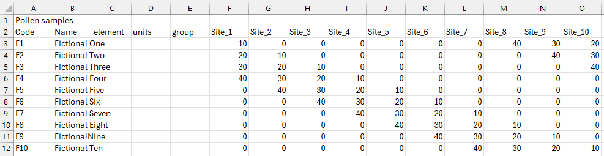

# Input files

## GIS map layers
GIS map layers are needed to provide information for the environmental variables that affect the model. They are incorporated into [the probabilistic and deterministic rules](rules_input_tab.md#rules-dissected) to determine where a vegetation community is placed. Commonly used environmental variables include height (for example a Digital Elevation model), geology and hydrology. Multiple input maps can be combined to include complex interactions between multiple environmental variables. 

While the original intent of the MSA is to write rules based on environmental information, other types of map layers can be used too. For example, MSA-Q can be used to test a previously made (non-MSA-based) vegetation cover reconstruction, in which case a map layer of the reconstruction can be used as input. MSA-Q can also be used to test fully simulated scenarios, based on map layers that have been simulated or hand-made. It is also possible to create a MSA-Q run that consists entirely of rules that are independent of input maps, for example when creating a fully randomized setup, in which case no input maps need to be added.

There are some limitations to what kind of map layers can be used as input for the MSA:

* Only vector polygon maps and raster map layers are suitable for use with the MSA. Point and line data can be given a buffer to turn them into a polygon layer. Keep the [resolution](spatial_and_environmental_input.html#resolution) of the project in mind when determining the width of the buffer.
* The file type needs to be able to be loaded into QGIS. QGIS has a wide range of file types that it can interpret, see the [QGIS documentation](https://docs.qgis.org/3.44/en/docs/user_manual/managing_data_source/opening_data.html). If the file type cannot be interpreted by QGIS natively, a plug-in may be available instead. Check the [QGIS plugin repository](https://plugins.qgis.org/), or open source code hosting services like GitHub.
* The file type should be one that gives you access to the fields and attributes, or in case of raster layer should have interpretable band values. Image-type map layers such as a WMS or non-vectorized georeferenced image are not suitable.
* The coordinate reference system of your map should be a projected (not geographic) one and should match with the rest of your project.

In addition, there are some recommendations:
* Make sure that the extent of your input map matches with the extent of your [Area of Interest](spatial_and_environmental_input.html#area-of-interest).
* Make sure that the resolution or scale are suitable for use in your reconstruction.
* Make sure that the file names, attribute names and attribute values are logical and can be interpreted independently. This will help with the later creation of rules, as well as the interpretation and post-processing of the output files.

The files need to be loaded into QGIS before they can be entered into MSA-Q. Editing the maps after the MSA-Q run has been set up may cause unexpected behaviour or crashes.

## Pollen percentages
A full MSA-Q reconstruction requires "real" pollen percentages to test against. These are given in the [pollen input tab](pollen_input_tab.html) in the form of a Tilia-based comma delimited text file/spreadsheet. 

The file should first have one row with only the first column filled with some kind of indication of the type of file (for example: "pollen samples"). The second row should contain the column names, in order: "Code", "Name", "element", "units", "group", followed by the site names, which should match exactly with the site names given in [sample sites](#sample-sites).
The column "code" should then be filled with the taxon names, which should match exactly with the taxon names as given in [taxa](vegetation_input.html#taxa). The other Tilia columns are optional. The columns with your site names should then be filled with the pollen percentages (not counts or proportions), and should sum to a 100 (if any pollen types were removed from the reconstruction, make sure to recalculate your percentages to sum to 100).

## HUMPOL handbag
The HUMPOL handbag is the input file used in the HUMPOL suite, the previous software used for MSA and MSA-like reconstructions. MSA-Q is not fully backwards compatible with HUMPOL, but some information from the HUMPOL handbag can be loaded into MSA-Q to save time. This includes the taxa, vegetation communities, and sampling points. Simply navigate to the HUMPOL (.hum) handbag file using the explorer.

## Point sampled map and Basemap
The point-sampled map and basemap are file created by MSA-Q, and can be created separately from a reconstruction. These can be imported to save time, for example when runs are similar or the same. Either the .csv file or the .sqlite file can be imported. Make sure that the environmental variables/input maps and vegetation communities match with the rest of the input in the [vegetation input tab](vegetation_input.html) and [rules tab](rules_input_tab.html), or an error will occur.