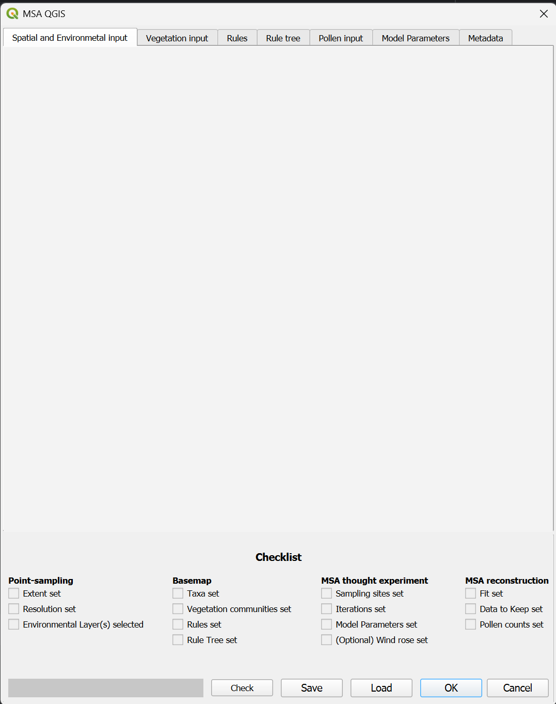

# Main dialogue window

## Tabs
For clarity, all of the input you need to give to run the model is subdivided into tabs. These all have their own 
documentation pages.

### [Spatial and environmental input tab](spatial_and_environmental_input.html)

### Vegetation input tab

### Rules tab

### Rule tree tab

### Pollen input tab

### Model parameters tab

### Metadata tab

## Checklist
The checklist is automatically checked when a certain field in the input is filled. It is meant to be used as a 
quick reference for which parts of the input you have provided and which you still have to do. Note that the checking 
of a box says nothing about the correctness of this information! It is simply a visual aid. 

The checklists are subdivided into the four modes of running MSA-Q, which need increasing amounts of information. 

## Buttons

### Check
The check button can be used to force the MSA-Q interface to re-check the checklist. This should happen 
automatically, but if it does not, you can force a check here.

### Save
This button opens the save dialog for saving your input. Note that saving the MSA-Q input does NOT also save your 
QGIS project with your input maps! This needs to be saved separately in QGIS.

### Load
This buttons opens the load dialog for loading previously saved input. 

### OK
This will open the run dialog for running the model. 

### Cancel
This will close the MSA-Q plugin window. It will NOT quit the plugin. If you restart the plugin from the QGIS 
toolbar, your previous information will still be there. If you need a clean MSA-Q interface, reload the plugin in 
the plugin menu. It functions in the same way as the operating system close window button at the top of the window.