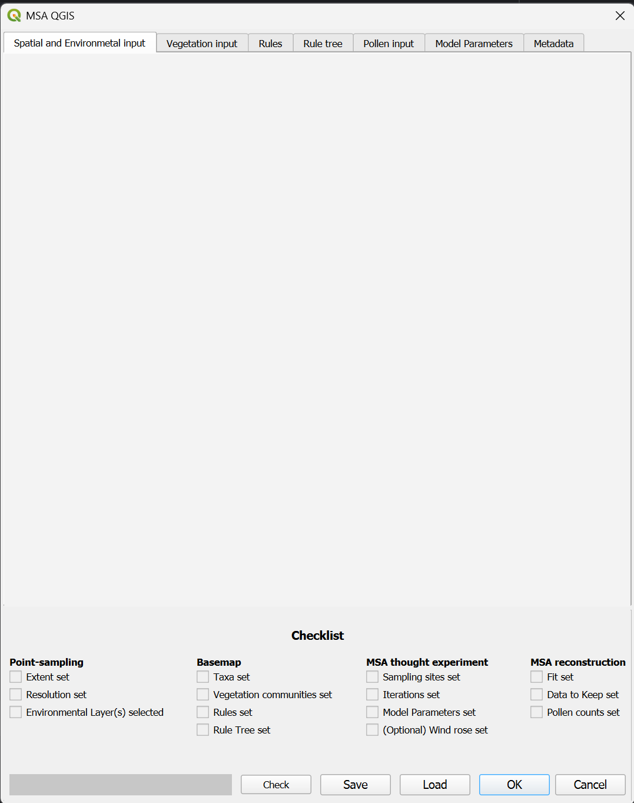
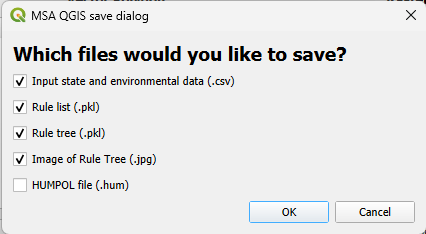
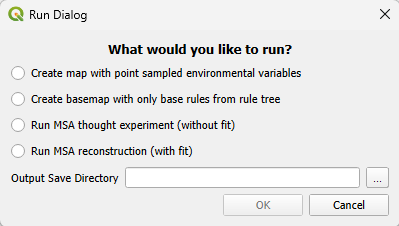

# Main dialogue window

## Tabs
For clarity, all of the input you need to give to run the model is subdivided into tabs. These all have their own 
documentation pages.

It is recommended to fill in information going from left to right in the tabs (with the exception of the [metadata input tab](metadata_input_tab.html), which should be kept up to date throughout the model setup progress). Some input affects the available options in the next input tab, for example choosing an [input map layer and field](spatial_and_environmental_input.html#available_fields/bands) will affect which environmental variables are available when creating rules, and creating a rule in the [rules input tab](rules_input_tab.html) will make it available to put into the [rule tree](rule_tree_input_tab.html). In the same manner, be mindful of removing values, which may break inputs in other tabs.

### [Spatial and environmental input tab](spatial_and_environmental_input.html)

### [Vegetation input tab](vegetation_input.html)

### [Rules input tab](rules_input_tab.html)

### [Rule tree input tab](rule_tree_input_tab.html)

### [Pollen input tab](pollen_input_tab.html)

### [Model parameters input tab](model_parameters_input_tab.html)

### [Metadata input tab](metadata_input_tab.html)

## Checklist
The checklist is automatically checked when a certain field in the input is filled. It is meant to be used as a 
quick reference for which parts of the input you have provided and which you still have to do. Note that the checking 
of a box says nothing about the correctness of this information! It is simply a visual aid. 

The checklists are subdivided into the four modes of running MSA-Q, which need increasing amounts of information. 

## Buttons

### Check
The check button can be used to force the MSA-Q interface to re-check the checklist. This should happen 
automatically, but if it does not, you can force a check here.

### Save
This button opens the save dialog for saving your input. Note that saving the MSA-Q input does NOT also save your 
QGIS project with your input maps! This needs to be saved separately in QGIS. 

See [save files](save_files.html) for more information on the save files.

### Load
This buttons opens the load dialog for loading previously saved input. 

### OK
This will open the run dialog for running the model. The run dialog has four radiobuttons for the four modes of running MSA-Q, which need increasing amounts of information. If information is missing, those options will be greyed out and not be selectable.

### Cancel
This will close the MSA-Q plugin window. It will NOT quit the plugin. If you restart the plugin from the QGIS 
toolbar, your previous information will still be there. If you need a clean MSA-Q interface, reload the plugin in 
the plugin menu. It functions in the same way as the operating system close window button at the top of the window.