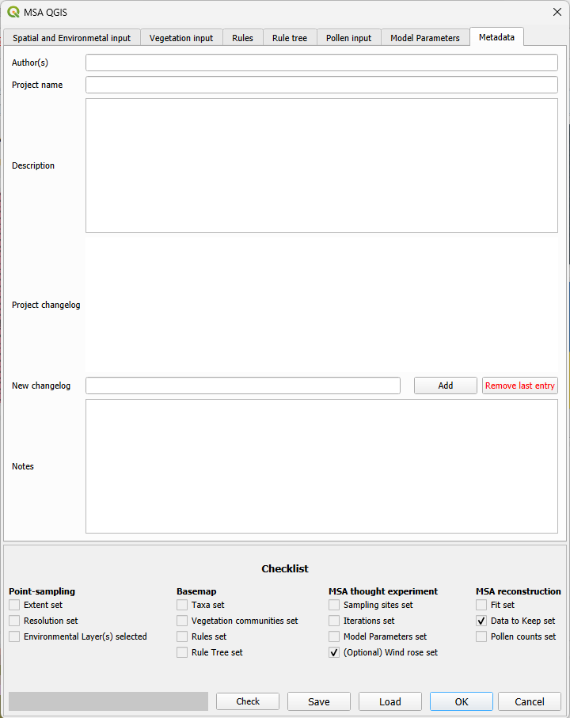

# The metadata input tab
This metadata is completely optional, however filling it out  is strongly recommended as it will help others (and you yourself in the future...) to identify which version or project this run was from, and/or which save file you currently have open.

It is especially strongly recommended to add this information if the model setup is going to be part of a publication.

## Author
For the names of people who have worked on the file and/or are associated with the project.

## Project name
Describe which model run this is.

## Description
This is a free field in which anything identifying the model setup can be described. Things to include are, for example: what (scientific) project is this model setup associated with? What was the context for creating this model setup? What variables are different in this model setup from any other model setups in the project? Is there an associated publication?

## Project changelog
A date and time stamped list of changes made to the file. Adding changes is manual, they will not be added automatically. Add a new changelog by adding text in the "New changelog" dialog box and clicking "Add". The current date and time will be added to the new entry automatically.

## Notes
A free text field for notes on this model setup.
