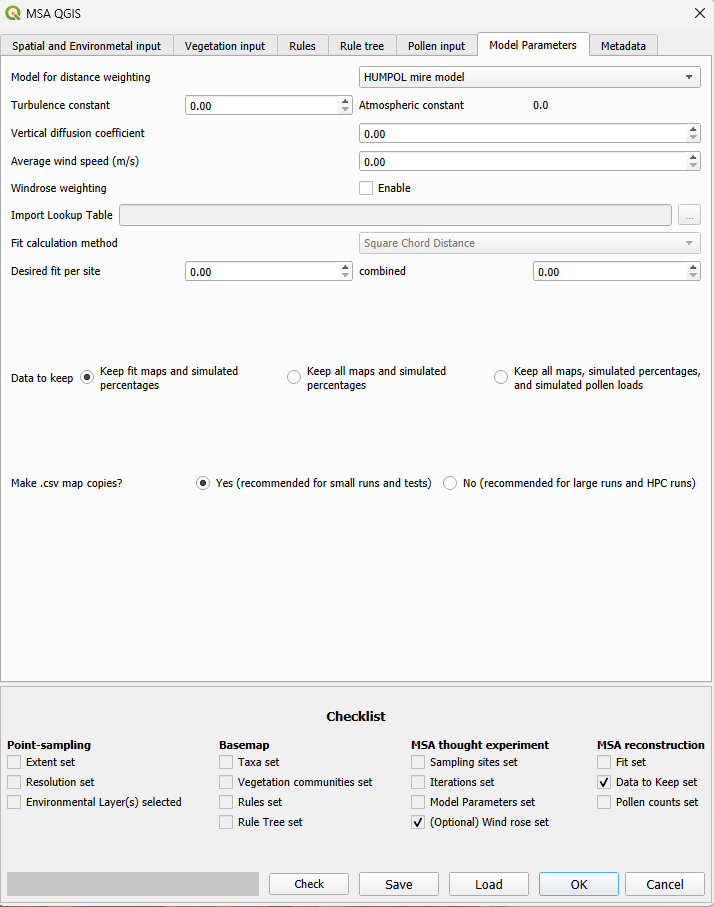

# The Model parameters input tab

The MSA, and by extension MSA-Q, is pollen dispersal and deposition (PDD) model independent. Therefore this input tab appears differently depending on the input model. This tab also includes several options that determine the treatment of the output, which are generally relevant for saving disk space and run time.

## Model for distance weighting
Choose the pollen dispersal and deposition (PDD) model, or pollen distance weighting model.

There are currently two model available:

#### The HUMPOL mire model.
This is a version of the Prentice-Sugita-Sutton model, or mire model, in which the integral function is replaced with a summation function, and which includes an adjustment factor for square grid cells instead of rings, so that it works with the grid-based approach of the MSA. This model is fully integrated into the workflow, which means that some parameters need to be set based on the particulars of the atmospheric behaviour of the site. Three parameters are required: The turbulence constant, vertical diffusion coefficient, and the average wind speed.

#### The LS (Legrangian Stochastic) unstable LOESS model.
As the Legrangian Stochastic model requires a lot of computation, this version of the model is not fully integrated, it instead assigns the taxa and distances to the closest RPPE, fall speed and distance values from a pre-calculated look-up table, for which most parameters are pre-determined based on unstable atmospheric conditions above a boreal conifer forest. 

Running this model requires having R installed on your machine and providing the location of Rscript so that the plugin can run R code from the DisQover package. The usual location of Rscript is something like: "C:\program files\R-4.5.2\bin\x64\Rscript.exe", but this varies per operating system, individual computer, and installation.

## Windrose weighting
This adds a directional weighting to the model, which can be assigned to 8 wind directions. The weighting is model independent, and fully optional.

## Import lookup table
This function has not yet been implemented. 

## Fit calculation method
This is the statistial distance metric that calculates the difference between the simulated pollen percentages and the provided (real) pollen percentages as given in the [pollen input tab](pollen_input_tab.html)
The only currently available fit calculation method is Square Chord Distance weighting. Other statistical distance metrics may be added in the future.

## Desired fit
### per site
This is the cut-off for a "good" fit for a map, for a single sampling site. It can currently only be set globally, not for each individual site, so choose the highest appropriate fit score. Since the rest of the MSA-Q uses pollen percentages and not proportions, the possible value range is 0-200.
### combined
This is the cut-off value for a "good" fit for a map, for all sampling sites cumulatively. The range of possible values is 0 - (number of sampling sites * 200).

## Data to keep
### Keep fit maps and simulated percentages
This option will cause the plugin to only save created vegetation cover maps that have a "good" fit score as determined in [desired fit](#desired-fit). This option is recommended if the non-fitted maps are not of interest as it will save a significant amount of disk space. Simulated percentages are saved, but simulated pollen loadings are not.

### Keep all maps and simulated percentages
This option will cause the plugin to save all created vegetation cover maps. Simulated pollen percentages are saved, but simulated pollen loadings are not. This option is recommended for smaller runs and exploratory runs.

### Keep all maps, simulated percentages and simulated pollen loadings.
This option will cause the plugin to save all simulated outputs, including all created vegetation cover maps, simulated pollen percentages and simulated pollen loadings. This option is only recommended when testing newly implemented pollen dispersal and deposition models. MSA-Q pollen loadings are dimensionless, relative values that are not comparable between runs.

## Make .csv map copies?
Toggling this option to yes will cause the plugin to save .csv delimited text versions of the maps that are easy to load into a GIS programme and can be loaded immediately into QGIS when the run finishes. These are created **in addition** to the maps that are saved in the sqlite database output file and will nearly double the disk space required to save the output. Using this option is recommended for small runs and test runs. It is strongly recommended **not** to use this option when you need to move the data before loading it into a GIS, for example when using a virtual computer or HPC, or when the run already requires a lot of disk space.

*Note that this input is currently not saved in the save file and needs to be set per run. The default value is yes.*