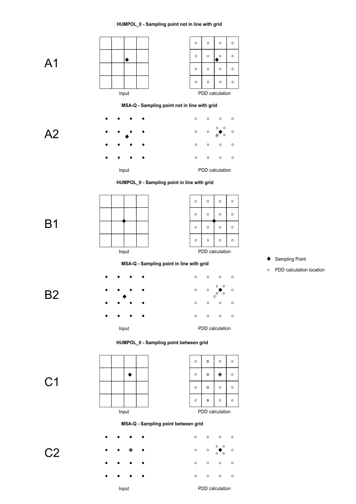
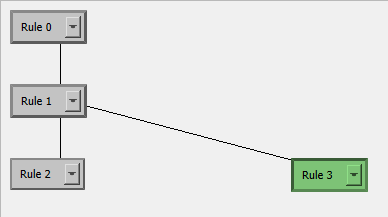

THIS PAGE IS A WORK IN PROGRESS

# Opening the black box - some notes on how MSA-Q functions

This section explains some particular behaviours of the MSA-Q code that are useful to know, because they affect the way model outputs are calculated, or because they affect the speed/efficiency of the plugin.

### Sampling site snapping
Sampling site coördinates are given by the user, however due to some quirks in the mathematical modelling, some adjustments need to be made to these coördinates in order to get realistic results. This is because of the use of discrete points from which the pollen originate, as opposed to a continuous area. If a sampling point is precisely on one of these vector points, the pollen percentages will be completely determined by just that one sampling point, as the distance is 0 and therefore the number of pollen deposited infinite. Similarly, if the sampling site is very close to one vector point, its pollen percentages will be overrepresented. While this follows neatly from the mathematical model, it does not represent reality well.

In order to avoid this, the sampling site is moved to the location of the nearest vector point of the vegetation map. This vector point is split into 4 "pseudo points", which all get assigned the same vegetation community as the original vector point, and only for the purpose of determining the pollen loadings for that sampling site, not any other sampling sites.

This means that the maximum distance a sampling site location is changed from its given coordinates is dependent on the [resolution](spatial_and_environmental_input.html) of the model setup. 

*Treatment of sample point location input when determining PDD distance and direction in HUMPOL_0 and MSA-Q. A) The sampling point is placed at coordinates that do not correspond to any PDD calculation locations. B) The sampling point is placed at coordinates that are in line with the edges of grid cells, or in other words at equal distance of multiple PDD calculation points. C) The sampling point is placed exactly between grid cell lines, or in other words exactly on a single PDD calculation point. 1) HUMPOL_0 grids, 2) MSA-Q vector points. Note that MSA-Q vector points correspond to the centres of HUMPOL_0 grid cells. Image from: van den Berg, W. B. (2025). Refining Reconstruction: Discovering the capabilities and limitations of pollen analysis using the Multiple Scenario Approach [Doctorate thesis, University of Hull]. https://hull-repository.worktribe.com/output/5563600*

### Rule tree order of operations and intermediate maps
In order to make the running of MSA-Q more efficient, the rule tree is not applied from top to bottom for each scenario, re-randomizing everything within iterations (between iterations, this randomization does take place). Instead, each time the rule tree branches, an intermediate version of the map is saved. 

Take this simple rule tree with one branch and two scenarios, and one iteration:

The expected behaviour might be that the two scenarios are run from top to bottom:

scenario 1: rule 0 --> rule 1 --> rule 2 --> final map 1

scenario 2: rule 0 --> rule 1 --> rule 3 --> final map 2

Where rule 0 and 1 are operated twice, and therefore any random placement of a vegetation from rule 0 and 1 will differ between the two scenarios. The function that applies a rule is run a total of six times.

However, this is not the case. Instead, for this configuration, rule 0 and rule 1 are applied and saved to an intermediate map, which is then used as a starting point for both scenarios. The function that applies a rule is run a total of four times. So:

intermediate map made before branching: rule 0 --> rule 1 --> intermediate map

scenario 1: intermediate map --> rule 2 --> final map 1

scenario 2: intermediate map --> rule 3 --> final map 2

The intermediate maps are not saved.

### Naming the scenarios and maps based on the rule tree

The scenarios are named based on the path through the rule tree. The first rule is always given the number 1, subsequent rules are numbered from 0 - 9, based on how many branches there are. This is independent of the rules assigned to the rule blocks. Given the previous simple example:

Scenario 1 is called: 100

Scenario 2 is called: 101

The map_id is contracted from this number, and the iteration. If two iterations of the rule tree above is run, four final maps are created, with the ids: 
100_1, 
101_1, 
100_2 and 
101_2.