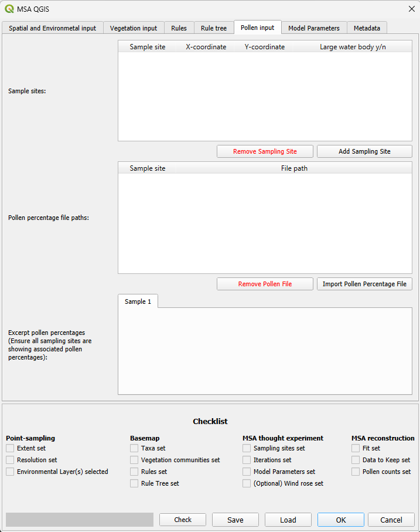
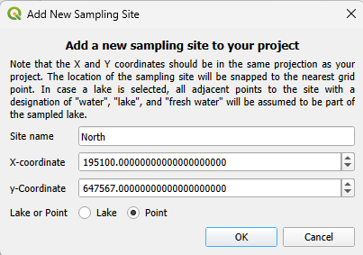
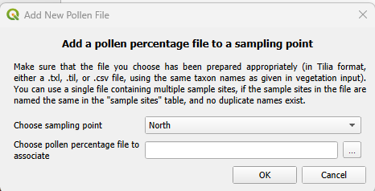
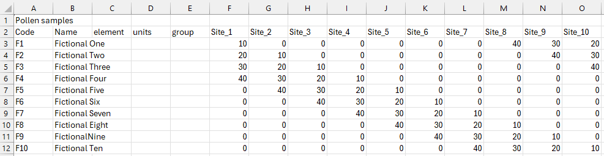

# Pollen input tab

## Sample sites
Click "add sampling site" to open a pop-up where a sampling location can be added. Currently four pieces of information are asked for:
* Site name: This should be a concise but unique and descriptive way to identify your site. It should correspond to the name of the site in the csv file with your pollen percentages.
* X and Y coordinate: These should be the coordinates of your site in the form of a point that corresponds in coordinate reference system to the rest of your project. The coordinates should fall within and not be too close to the edge of your [Area of Interest](spatial_and_environmental_input.html#area-of-interest). Make sure to check the X and Y coordinates are not switched around.
* Lake or Point: This point can be ignored in the current build of MSA-Q, as a lake version of the model is not yet implemented. 

## Pollen percentage file paths
Once a sampling site has been added, you can click "Import pollen Percentage File" to import your pollen percentages. A pop-up will open where you can select your site from a dropdown based on the sites given in [sample sites](#sample-sites) and then link to the file with the explorer. The only currently accepted format is a csv spreadsheet that follows the Tilia format. This action needs to be repeated for each site, even if the information is in the same spreadsheet.

The file should first have one row with only the first column filled with some kind of indication of the type of file (for example: "pollen samples"). The second row should contain the column names, in order: "Code", "Name", "element", "units", "group", followed by the site names, which should match exactly with the site names given in [sample sites](#sample-sites).
The column "code" should then be filled with the taxon names, which should match exactly with the taxon names as given in [taxa](vegetation_input.html#taxa). The other Tilia columns are optional. The columns with your site names should then be filled with the pollen percentages (not counts or proportions), and should sum to a 100 (if any pollen types were removed from the reconstruction, make sure to recalculate your percentages to sum to 100).

The file path is absolute, not relative, and so if the file is shared with someone on another computer, it will need to be reconfigured. When loading an existing MSA-Q save file, if the pollen percentage file is not found the given path, the user is prompted to enter new paths.

## Excerpt pollen percentages
When a pollen percentages file has been added, this section can be used to check if the file was added correctly. Only the first 10 rows of the pollen percentages file are shown. A new tab is created for each sampling site.