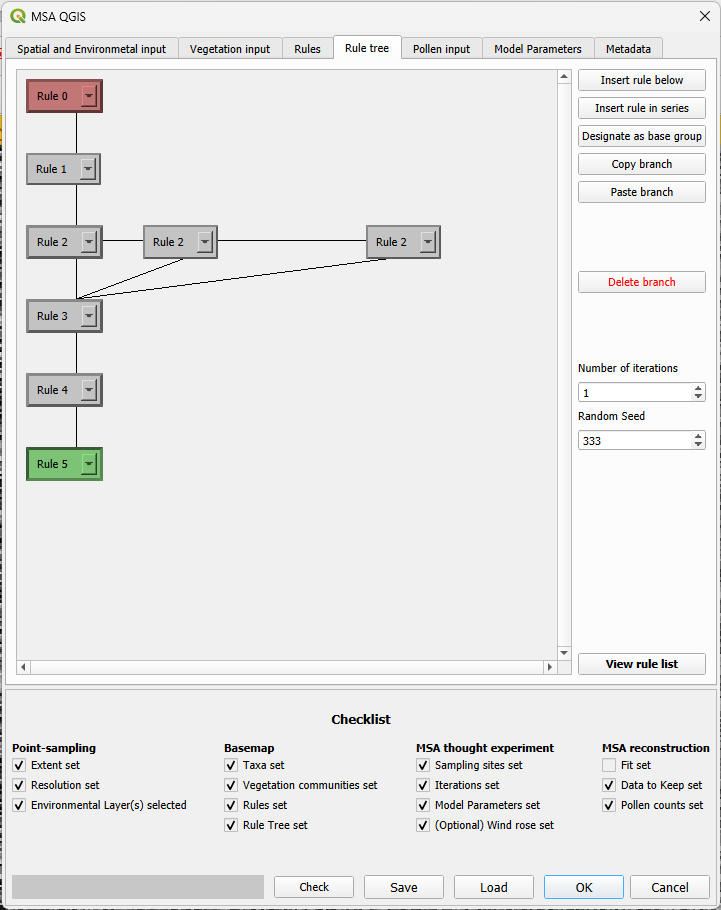
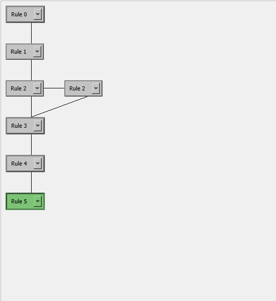
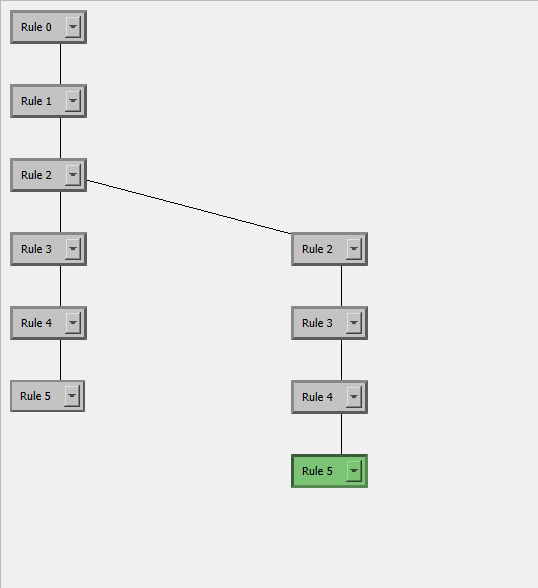
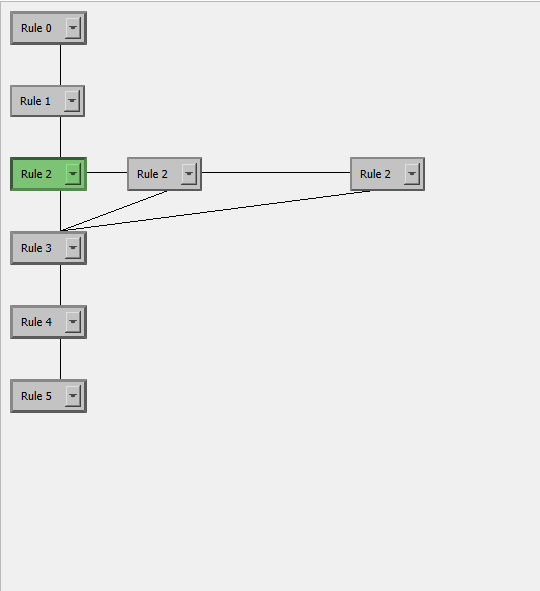

# The rule tree tab

The rule tree is the replacement for the coding-based interface of HUMPOL and is effectively a visual programming tool. Rules are put in order to lead to different testable scenarios. The rules are executed from top to bottom, with each branching in the tree leading to a new scenario. 

The rules consist of blocks, each with a single associated rule that can be chosen and changed from a dropdown menu, which lists all the rules created in the [rules](rules.html) tab. Lines between the blocks show how they are connected. A **grey** block is a regular rule block. A **red** block is part of the base group (see [base group](#designate-as-base-group))

## Insert rule below
This inserts a connected rule under the currently selected rule block, or creates the first rule block if there are no rule blocks. If the selected rule block already has a connected rule block, a second rule block will be created in a new branch (by extension, this will therefore create a new scenario). A maximum of 10 branches can be connected to a single rule block.

## Insert rule in series
This creates a special case of connected rule blocks under the currently selected rule block. It consists of four rule blocks, in which the blocks that are created side-by-side follow from each other but ALSO connect to the rule block below. This construction is meant for creating sets of rules with stepwise changes, for example for testing incremental increases. This can also be done with regular branches, however this can make the rule tree very big very quickly and can greatly increase the necessary amount of editing (see images below).

*The above rule in series is equivalent to the branch structure below:*

Selecting one of the rule blocks within the series construction and clicking "insert rule in series" again, will add another rule in the series, instead of creating another block, see images below.

## Designate as base group
The "base group" is a set of rules that is only executed once at the start of the run, even when there are multiple iterations. They are coloured **red**. The base group is not strictly necessary, but is implemented as a time-saving measure for long runs, as it will avoid each iteration repeating a set of rules that have the same outcome. Some conditions apply: 
* The base group can only apply to rules at the top of the rule tree.
* The base group can have no branches (and therefore also no [rules in series](#insert-rule-in-series))
* All rules in the base group should be deterministic (have 100% chance to happen) meaning that the set of rules would always lead to the same outcome.

## Copy branch and Paste branch
Rule trees often contains repeating structures. Clicking "copy branch" will copy the branch from the selected (green) block downwards, including their currently selected rules. Clicking "paste branch" will paste the previously copied branch under a selected block.

## Delete branch
Clicking "delete branch" will delete from the selected rule block downwards. Note that it is not possible to delete individual blocks from within the chain. 

## Number of iterations
This sets the number of times the entire rule tree (with the exception of the [base group](#designate-as-base-group)) will be executed. Given probabilistic rules, there will be differences in the placement of vegetation communities that can have a profound effect on the outcome of the model.

**Note that there is currently no limit on the number of iterations. It is recommended as a rule of thumb NOT to exceed the number of cores your computer has available.**

## Random Seed
Computers can not be truly random, however they can approach randomness. A [random seed](https://en.wikipedia.org/wiki/Random_seed) is a number that initialized the randomization process, in this case for the probabilistic rules. The benefit of this, is that they can be supplied a seed number, and that this seed number can be used to make a run completely repeatable (providing that the underlaying code for the randomization is not changed). This means that MSA-Q runs can be repeated and checked for (peer) review.

## View rule list
This is a convenience feature that opens a pop-up with all of the rules from the [rules input tab](rule_tree_input_tab.html). The rules cannot be edited from here, but they can be viewed alongside the rule tree without having to repeatedly switch between the tabs.
