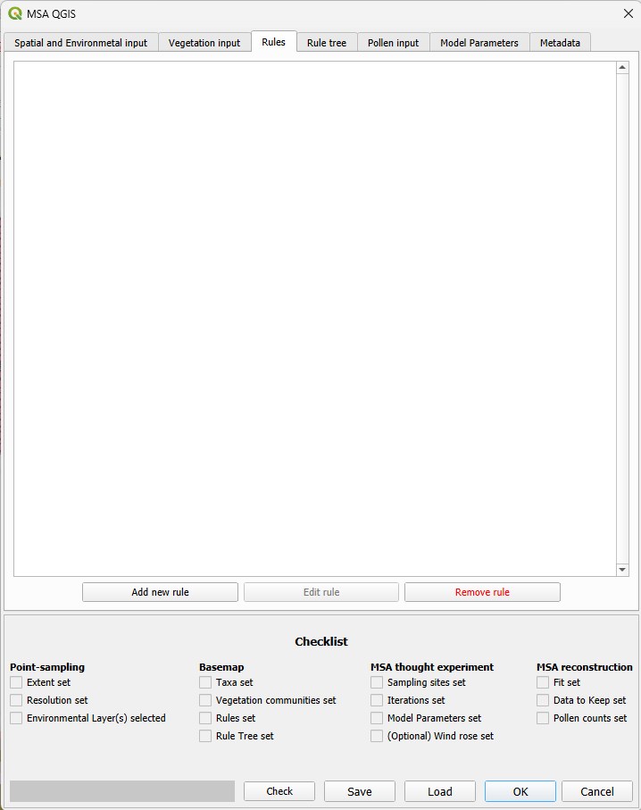

# The rules input tab

Probabilistic and deterministic rules form the basis of the MSA. MSA-Q uses a graphic, menu-based interface (GUI), which allows the presentations of these rules in human-readable language.

## Adding a new rule

Click the "add new rule"-button. A pop-up will open. The rule will automatically be assigned the lowest available number, counting from 0.

### Choose a vegetation community
From the dropdown, choose a vegetation community. This is a list of communities as defined in the [vegetation input tab](vegetation_input.html). This is the community that will placed based on this rule.

### Choose a rule type
Currently, two rule types are available:

* **(Re)place** will place the vegetation community, regardless of whether there are any previously placed points with this vegetation community.
* **Encroach** will place the vegetation community in a certain radius around points that already have this vegetation community. Upon choosing this rule, an additional fillable field ("Spread by N distance") will appear, in which the distance from existing points can be given. This value is given in map units, which is dependent on the Coördinate Reference System of your project. Make sure to keep your chosen [resolution(s)](spatial_and_environmental_input.html) in mind when setting this value.

The "adjacent" and "extent" rule types are not yet available.

### Set the chance
Under chance, set the percent chance this rule has to take place. 
* Note that this does NOT set the percentage of the area to be filled, but the chance that a point that complies to the conditions will be filled. 100% chance makes a deterministic rule, any less will make a probabilistic rule. A maximum of two decimal points of detail are possible.
* Note also, that order rules are placed in in the [rule tree](rule_tree_input_tab.html) may affect the probabilities. For example, if you have an empty map, and you want to fill approximately 25% with "Heath" and 25% with "Forest", The first rule that replaces "Empty" with "Heath" should be 25%, but the second rule that replaces "Empty" with "Forest" should be 33.33%, since 25% of Empty was already replaced with "Heath".

### Choose a previous vegetation community
This creates a condition for the rule to only occur for points on which this/these vegetation communities was/were already placed based on a rule prior to it in the [rule tree](rule_tree_input_tab.html). If it is set to "Empty", only vector points that have not already had vegetation communities placed on them will be replaced. Checking the "any" radio button means that any vegetation community (including "Empty") can be replaced.

Multiple previous vegetation communities can be added by pressing the "add conditional" button below the fields for Choose a previous vegetation community. Since a vector point can only have a single assigned vegetation community, is this always an **exclusive** rule (vegetation community A OR vegetation community B).

### Choose an environmental variable
Choosing a value here will create a condition for the rule to only occur for points that have a certain value based on one of your chosen (environmental) input maps. The dropdown will contain only those maplayers and fields selected in the [spatial and environmental input tab](spatial_and_environmental_input.html). In case of a categorical field, one attribute from said field can be chosen. In case of a numerical field or band, a range can be given. Values for such a range are always inclusive.

Leaving the field on "Empty"/ Selecting no environmental variable means that there will be no constraints based on any of the (environmental) input maps.

Multiple environmental conditions can be added by clicking the "add conditional" button below the fields for "Choose an environmental variable". These conditionals are always **inclusive** (condition A AND condition B). If you want an exclusive conditional (condition A OR condition B), this can be achieved by writing two rules and creating two branches in the [rule tree](rule_tree_input_tab.html).

### Check rule
Clicking the "check rule" button at the bottom of the pop-up will convert your fillable fields and dropdowns into a human-readable sentence at the bottom left of the pop-up, so that you can check if the rule is what you expect. 

## Remove a rule
Select a rule in the rule list, and click the "Remove rule" button at the bottom right of the tab. Removed rules cannot be retrieved.

## Rules: dissected

### A probabilistic rule with three constraints

A rule might read:

"Rule 4: Birch has 70.0% chance to be placed on Heath, where Treeline - Treeline is Below, and Geology - GeologyName is Metamorph."

- This is a probabilistic rule with two environmental conditionals and one previous community conditional.
- "Birch" and "Heath" are vegetation communities as determined in the [vegetation input tab](vegetation_input.html).
- "Treeline - Treeline" and "Geology - GeologyName" are a combination of the map layer name ("Treeline" and "Geology") and the chosen fields ("Treeline" and "GeologyName") as determined in the [spatial and environmental input tab](spatial_and_environmental_input.html).
- "Below" and "Metamorph" are values that are available within the chosen fields.
- "Birch" is the vegetation community to be placed based on this rule.
- "Heath" is a vegetation community that is replaced. A rule prior to this rule that placed the Heath should be assigned in the [rule tree](rule_tree_input_tab.html). If no Heath was placed previously, no Birch will be placed.
- 70.0% chance is the chance that any one vector point that complies with the conditions will be assigned the vegetation community. The conditions being:
  - The current value of vegcom on that point has to be "Heath"
  - The value for Treeline - Treeline for that point has to be "Below"
  - The value for Geology - GeologyName for that point has to be "Metamorph"
  
  Note that this does not mean a total of 70% of the points complying to these conditionals will become "Birch", but that there is a 70.0% chance for each of the points to be changed. In practice, this will result in a bell curve around 70%, with more iterations resulting in more variation.