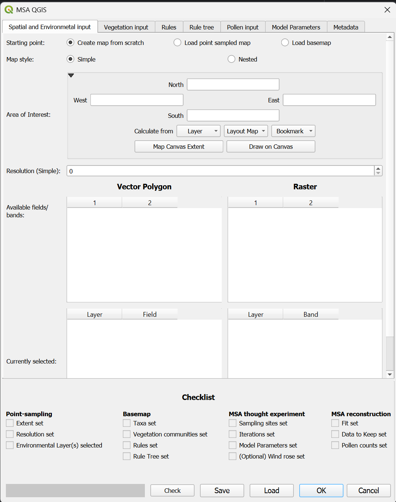

# The Spatial and Environmental input tab

## Starting point
### Create a map from scratch

### Load point sampled map

### Load basemap

## Map style

### Simple

### Nested

## Area of Interest

## Resolution
### Resolution (simple)

### Resolution (nested)

### Size of nested area

## Available fields/bands

