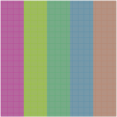
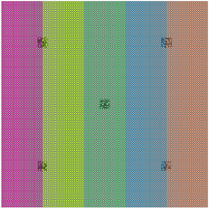
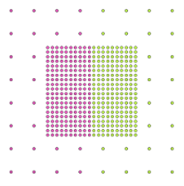

# The Spatial and Environmental input tab

## Starting point
The starting point can be changed if you have previously run the plugin and already have a point-sampled map or 
basemap. This feature is mainly available to save time, however it can optionally also be 
used to experiment with 
custom maps. 

### 1. Create a map from scratch
This is the option to use if you are setting up a new modelling run. MSA-Q will create a new vegetation map from 
scratch.

### 2. Load point sampled map
This will load a map layer that does not yet have any assigned vegetation, but does have the information from 
the user-provided input maps. When running MSA-Q using option 1, there is the option to (only) create a point-sampled map. See [running the plugin]() for more information.

This will skip (and make invisible) the options [area of interest](#area-of-interest) and [resolution](#resolution). An option 
for uploading a file will appear. This requires a csv file with the same columns as those MSA-Q creates, or the 
sqlite file point_sampled_map.sqlite as created during a point sampled map creation run (see [running the plugin]()).

### 3. Load basemap
This will load a map layer with points to which the data from your input maps have already been copied, and the 
[base group]() rules already applied, meaning some vegetation communities have already been assigned. See [running 
the plugin]() for more information.

This will skip (and make invisible) the options [area of interest](#area-of-interest) and [resolution](#resolution). An option 
for uploading a file will appear. This requires a csv file with the same columns as those MSA-Q creates where no "empty" values are present in the vegcom column, or the sqlite file point_sampled_map.sqlite as created during a point sampled map creation run (see [running the plugin]()).

## Map style
Two styles of map are available. Note that while it mainly is used to dictate the map creation, if a basemap or point-sampled map is loaded, whether this is a simple or nested map should still be indicated.

### 1. Simple
A "simple" map style is when there is only a single resolution for the vegetation maps. The created vegetation maps will consist of equally spaced points within the [area of interest](#area-of-interest).

### 2. Nested
A "nested" map style is when the wider area is represented in a courser resolution than the local area around the [sampling sites](). The created vegetation maps will consist of squares with the size given in [size of nested area](#size-of-nested-area) around the sampling sites in which equally spaced points are placed according to the value in [resolution (nested)](#resolution-nested). These are surrounded by a rectangle given in the [area of interest](#area-of-interest) which contains equally spaced points according to the value in [resolution (simple)](#resolution-simple). 

In order to avoid the occurrence of strips of vegetation being represented twice or not at all, the simple resolution should be a multiple of the nested resolution and the size of the nested area should be divisible by the nested resolution and a multiple of the simple resolution. 

The lower-resolution, outer area can be considered the "background", while the smaller, higher resolution areas can be considered the "local" component, for the purposes of simulating pollen percentages. See [notes on determining the size of the nested area]() for more information.

   

## Area of Interest
This option is only available when [creating a map from scratch](#1-create-a-map-from-scratch).

The area of interest markt the North, East, South and West outer bounds of the rectangle area that you want to model the vegetation for. There are three ways to set this value:

**Calculate from layer:** This will copy the outer extents of a chosen map layer that is loaded into the QGIS interface. Recommended method for repeatability.

**Map canvas extent** This wil copy the outer extents of your *current* screen view in the QGIS interface. This is only recommended for quick and short test runs.

**Draw on canvas** This will direct you back to the QGIS interface, where you can freehand draw on the map.

The extent is given in the map units associated with the [Coordinate Reference System (CRS)](https://docs.qgis.org/3.44/en/docs/gentle_gis_introduction/coordinate_reference_systems.html) chosen. (e.g. EPSG:27700 or British National Grid uses meters, EPSG:3485 or Arkanses North (ftUS) uses feet). Note that geographic CRS (such as EPSG:4326/WGS 84) that use degrees are not suitable for use within MSA-Q.

## Resolution
### Resolution (simple)
This is the distance between points on the vector point grid of the vegetation maps on both the X and Y axis, given in map units which depend on the [CRS](https://docs.qgis.org/3.44/en/docs/gentle_gis_introduction/coordinate_reference_systems.html).

In case of a [simple map style](#1-simple), this is for the entire map. 

In case of a [nested map style](#2-nested) this is for the outer/background grid, and should be a multiple of both [nested resolution](#resolution-nested) and [size of nested area](#size-of-nested-area). 

### Resolution (nested)
This is the distance between points on the vector point grid of the vegetation maps on both the X and Y axis for the local area around sampling sites, given in map units which depend on the [CRS](https://docs.qgis.org/3.44/en/docs/gentle_gis_introduction/coordinate_reference_systems.html). Both the [simple resolution](#resolution-simple) and [size of the nested area](#size-of-nested-area) should be divisible by this value.

This box is only available when [nested map style](#2-nested) is checked. 

### Size of nested area
This is the size of the nested local area directly around sampling sites, given in map units which depend on the [CRS](https://docs.qgis.org/3.44/en/docs/gentle_gis_introduction/coordinate_reference_systems.html). This value should be divisble by the [nested resolution](#resolution-nested) and a multiple of the [simple resolution](#resolution-simple).

This box is only available when [nested map style](#2-nested) is checked. 

## Available fields/bands
This section is where the (environmental) input maps that are the basis for the [rules](rules.html) can be given. The top boxes are where the input maps can be chosen. If a vector field or raster band is selected by clicking or dragging in the top box, it will appear in the lower box. Clicking or dragging in the top box again will deselect it. Map layers will only be available if they are loaded into QGIS and set to visible. 

**Vector:** The left two panels show the vector polygon map layers and their fields. Virtual fields and hidden fields such as the geometry field are not available for selection.

**raster:** The right two panels show the raster map layers and their bands. These names may be less straight forward than the vector fields. Make sure that you identify correctly which band contains the data you want to use.