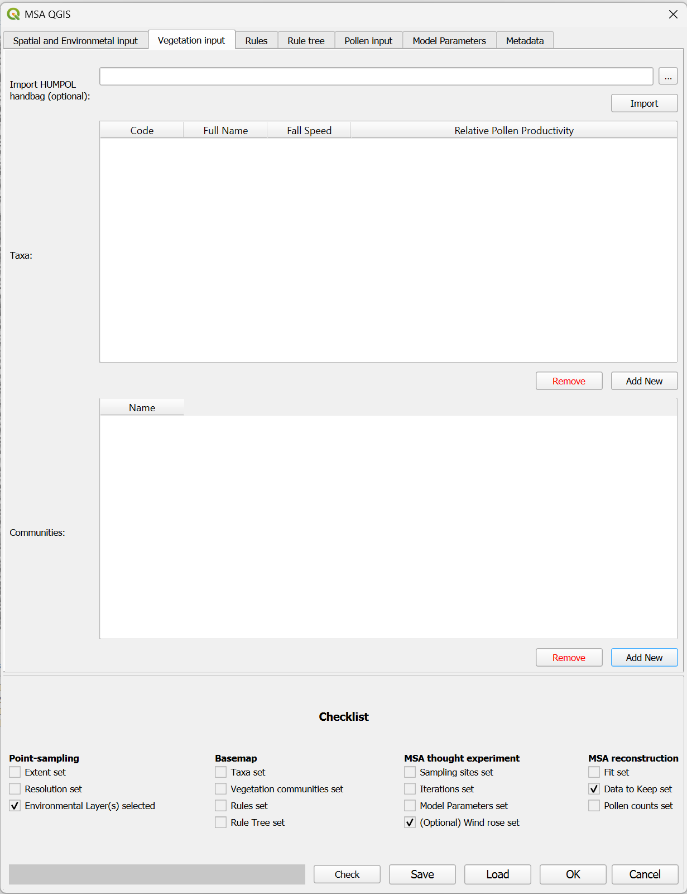

# The vegetation input tab

## Import HUMPOL handbag (optional)
This option is available for backwards compatibility with the HUMPOL_0 suite. If you would like to repeat or update a project previously done in HUMPOL, you can load the information directly from the HUMPOL handbag. This will include the taxa, vegetation communities, and sampling points. Please note that this information is not enough to run the model, and that the HUMPOL handbag cannot be used as a replacement save file.

## Taxa
This table contains data for the taxa that will be used in the modelling. These are not placed directly on the vegetation maps, but do provide the modelling parameters per taxon.

**Adding a taxon:** Click "add new" underneath the table to add a new taxon. This will open a pop-up window asking for the information required to run the model: Code, full name, fall speed and Relative Pollen Productivity Estimate (RPPE). The short name should be kept short but unique from other taxa and cannot contain spaces, this is the name that is used in further output files and modelling. The long name allows for more specificity, it is not used in the model or output files and is meant to be comprehensive. The fall speed should be in m/s.

**Removing a taxon:** Select a taxon in the table by clicking on it, and then click the "remove" button underneath the table.

## Communities
 This table contains the data for the vegetation communities that will be used in modelling. These are the units that are placed on the vegetation maps. As taxa are added to vegetation communities, the table will be filled with the taxa and their percentages in the vegetation communities.
 
**Adding a vegetation community:** Click "add new" underneath the table to add a new community. This will open a pop-up window asking for the information required to run the model: The name of the community, one or multiple taxa as from the [taxon table](#taxa), and the percentage of cover per said taxa within that vegetation community. The name should be short but unique, and should not contain spaces. The name can also not be "Empty" as this name is used internally to indicate that nothing has been assigned to a particular vector point (call it "bare" instead, for example). The percentages do not have to sum to 100 (with missing percentages being interpreted as non-pollen producing area such as bare ground, water, or non-pollen producing plant cover). Percentages should not pass 100%.

**Removing a vegetation community:** Select an existing vegetation community and click "remove" underneath the table.